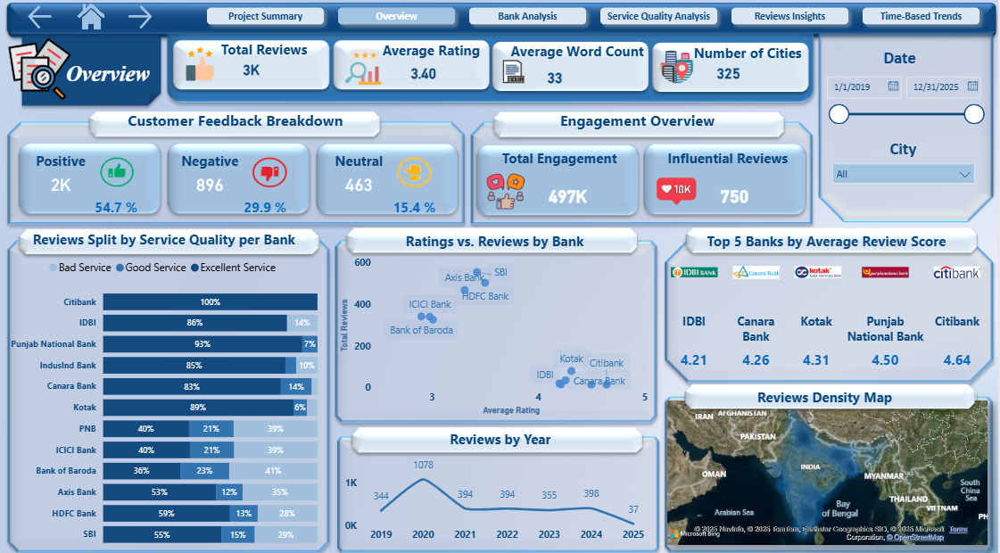

# 📊 Indian Banks Reviews Dashboard – Overview Page

_This Power BI dashboard was developed as part of a **group project** analyzing customer feedback and service quality across major Indian banks.  
The project aimed to uncover sentiment trends, ratings distribution, and engagement insights to help identify key strengths and areas for improvement._

### 👩‍💻 My Role
I was responsible for developing the **Overview Page** of the dashboard and handling the data preparation processes.

### 🧩 Key Contributions
- Performed **data cleaning and transformation** to ensure dataset accuracy and consistency.  
- Built the **data model using a star schema** for optimized relationships and queries.  
- Developed **DAX measures** used for KPIs, sentiment analysis, and performance insights.  
- Designed and implemented the **Overview Page visuals**, including KPI cards, sentiment breakdown, and interactive filters.

### 📄 Documentation
_A detailed summary of my work is available in the_  
[**Overview_Page_Data_Preparation_and_Design_Summary.pdf**](Documentation/Overview_Page_Data_Preparation_and_Design_Summary.pdf)

This document describes:
- The **data cleaning steps** performed  
- The **data modeling (star schema)** structure  
- The **calculated columns** and **measures** developed  
- The **design and layout** of the Overview Page

### 🛠️ Tools & Skills Used
- **Power BI** – Dashboard design and interactivity  
- **Data Cleaning & Modeling** – Ensuring accurate, structured insights  
- **DAX** – KPI and measure development  
- **Data Visualization & Storytelling** – Presenting insights clearly  

### 🌟 Key Features
- 📈 **KPI Cards:** Display total reviews, average rating, and engagement metrics.  
- 💬 **Sentiment Analysis:** Visual breakdown of positive, neutral, and negative reviews.  
- 🏦 **Top Entities:** Highlights best-performing banks and key trends.  
- 🧭 **Interactive Filters:** Enable analysis by city, date, or sentiment category.  
- 🎯 **Dynamic Visuals:** Tooltips and drill-through options for deeper insights.  

## 🖼️ Dashboard Preview

